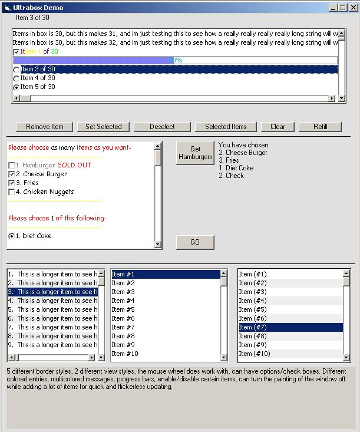



## Ultrabox \- A Listbox Replacement User Control

### Description

This is a user control to replace the standard listbox control. It has many more options then the default listbox control, plus more pleasently looking views. Can also have check boxes/options in the listbox. A progress bar may also be added. The items in the box can have custom colors and the messages may be multicolored by using the color codes. Check it out! I'd love to see your comments.
 
### More Info
 

             |
---                |---
**Submitted On**   |2003-04-12 16:37:18
**By**             |[Chris Van Hooser](https://github.com/Planet-Source-Code/PSCIndex/blob/master/ByAuthor/chris-van-hooser.md)
**Level**          |Intermediate
**User Rating**    |4.6 (32 globes from 7 users)
**Compatibility**  |VB 6\.0
**Category**       |[Custom Controls/ Forms/  Menus](https://github.com/Planet-Source-Code/PSCIndex/blob/master/ByCategory/custom-controls-forms-menus__1-4.md)
**World**          |[Visual Basic](https://github.com/Planet-Source-Code/PSCIndex/blob/master/ByWorld/visual-basic.md)
**Archive File**   |[Ultrabox\_\-1572824122003\.zip](https://github.com/Planet-Source-Code/chris-van-hooser-ultrabox-a-listbox-replacement-user-control__1-44699/archive/master.zip)

